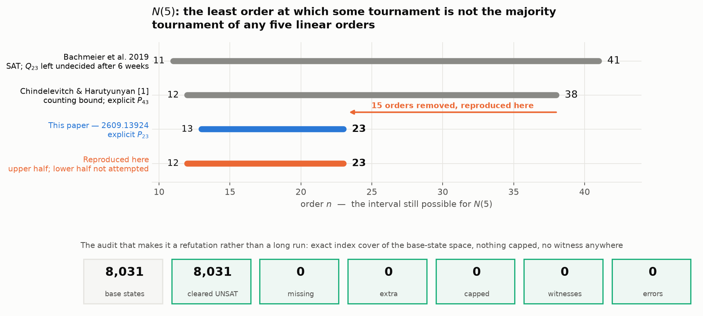
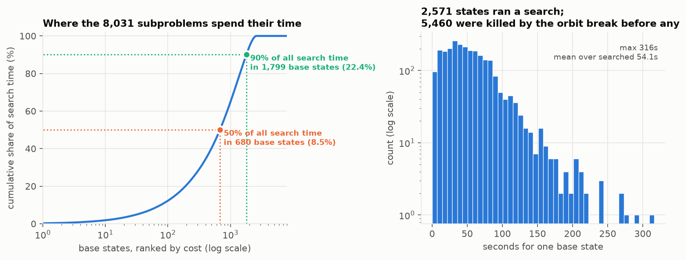
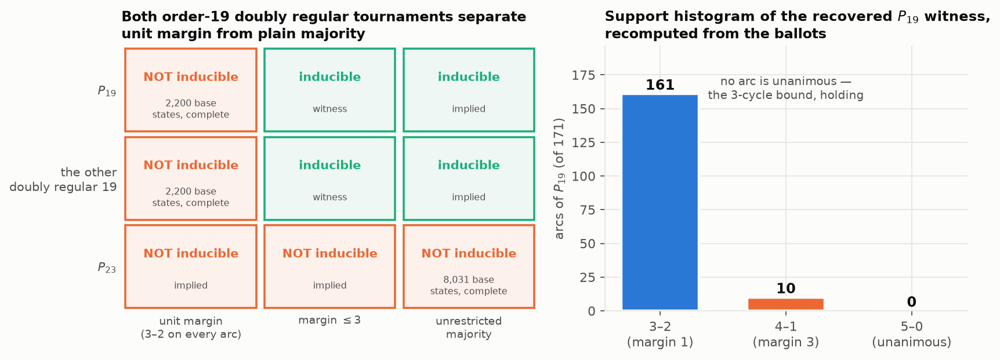
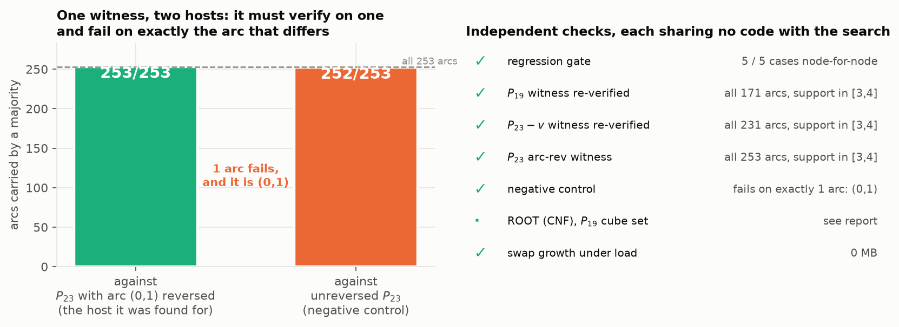
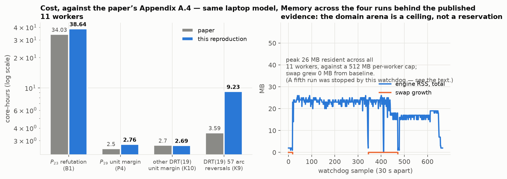

# Paley(23) is not the majority of five voters — a reproduction of arXiv 2609.13924



Five people rank a set of candidates. For each pair, whoever more of them put
first wins that pair. The wins form a *tournament*: a complete graph with every
edge directed. Which tournaments can arise this way?

Counting says almost none can — there are vastly more tournaments on $n$
vertices than five rankings could ever produce — but counting names no
particular one. So the question becomes a number:

> $N(5)$ is the least $n$ such that **some** tournament on $n$ vertices is the
> majority of no five rankings.

Only $N(3) = 8$ is known exactly. For $N(5)$, the paper reproduced here narrows
$12 \le N(5) \le 38$ to $13 \le N(5) \le 23$. **The upper half is what this
reproduction tested**, and it reproduced: one specific 23-vertex tournament, the
Paley tournament $P_{23}$, was confirmed to be beyond five voters by a complete
search over all 8,031 subproblems, on this laptop, in PLACEHOLDER_P23_WALL.

That instance has a history. Bachmeier et al. put it to a SAT solver in 2019 and
reported it unresolved after six cumulative weeks.

## What makes this instance hard

$P_q$, for a prime $q \equiv 3 \pmod 4$, has an arc $i \to j$ exactly when
$j - i$ is a nonzero square mod $q$. It is as far from a ranking as a tournament
gets, and it is highly symmetric — $|\mathrm{Aut}(P_q)| = q(q-1)/2$ — which is
what makes an otherwise hopeless search merely very hard.

The previous paper refuted $P_{43}$ with **no search at all**, using a quantity
called the slack: small slack pins the five voters close to the single best
ranking, and at $q = 43$ that left about 1.8 million cases to enumerate. But
slack is not monotone in $q$:

| $q$ | 7 | 11 | 19 | **23** | 31 | 43 |
|---|---|---|---|---|---|---|
| slack$_5$ | 7 | 10 | 22 | **46** | 30 | 6 |

$q = 23$ is a local **maximum**. The cheap argument is useless exactly where the
bound would improve most, and that is why $P_{23}$ needed a decision procedure
rather than a structural observation.

## The code path

The engine is one C translation unit, `kinduce.c` (1,343 lines). Its shape:

```
MAIN   for each base state (k orders of a 5-vertex base B, up to voter relabelling):
           if some unplaced vertex has an empty domain: this base state is dead
           if DFS succeeds: return the witness
       return "not k-inducible"                    # no base state extends

DFS(S) v* <- argmin |D(v | S)| over unplaced v     # MRV, recomputed at EVERY node
       for each slot tuple p in D(v* | S):
           insert v* at p in each of the k orders
           D(w | S') <- REFINE(D(w | S), p, w, v*) # child domains refine the parent's
           if any is empty: undo, next p
           if DFS(S') succeeds: return its witness
```

Three choices carry the performance, and the paper is explicit that the second
matters most — worth a factor of about 110 against a factor of a few for the
first:

1. **Dynamic MRV.** Insert the vertex with the fewest legal insertions left,
   recomputed at every node rather than fixed per base state.
2. **Incremental refinement.** A child's domain is *lifted* from its parent's —
   slots below the insertion point are unchanged, slots above shift by one,
   slots that coincide split in two — and then filtered by the single new arc.
   Cost is proportional to surviving tuples, not to the whole slot space.
3. **Symmetry, discharged outside the engine.** The $k!$ voter relabellings are
   absorbed into the definition of a base state. $\mathrm{Aut}(T)$ is spent via
   an *anchoring* lemma: some voter may be assumed to lead with one of a chosen
   set of orbit representatives. The engine cannot compute $\mathrm{Aut}(T)$ and
   does not try — the representatives are a caller obligation, which is exactly
   why they appear on the command line as `--top0rr 2 5`.

The decomposition into base states is what makes the whole thing parallel: the
8,031 base states partition the search space, so any slice of them is an
independent subproblem and the union of all slices is a proof.

## How the reproduction was run

Every node of the experiment tree runs the identical command,
`bash repro2609/run.sh`, and differs only in a one-line config file:

```sh
# repro2609/claims.conf — the entire difference between the headline node and its siblings
CLAIMS="build p23"
```

The driver pins the authors' package by full commit SHA rather than vendoring a
copy, and refuses to run if the checkout is not that commit:

```sh
git -C "$CACHE" checkout --quiet "$UPSTREAM_SHA"
got=$(git -C "$CACHE" rev-parse HEAD)
[ "$got" = "$UPSTREAM_SHA" ] || { echo "FATAL: upstream HEAD is not the pin"; exit 1; }
```

Two decisions in the harness are load-bearing.

**One invocation per base state, off a shared queue.** The package slices with
`--bs-from`/`--bs-to`, and the paper's own run used 2,008 contiguous slices. The
reproduction instead runs all 8,031 base states as separate one-state
invocations pulled off an 11-worker `xargs -P` queue. Startup is 83 ms, so the
overhead is negligible, and it buys two things: near-perfect load balance across
states whose costs span orders of magnitude, and a per-state record.

**The completeness certificate is an index cover, not a count.** A worker writes
its marker only on `RESULT UNSAT` with `capped=0`:

```sh
case "$res" in
    *"RESULT UNSAT"*)
        if [ "${capped:-1}" = "0" ]; then : > "$outdir/done/$idx"; fi ;;
```

so a capped, crashed or killed state leaves no marker at all. The audit then
compares the *set* of cleared indices against `seq 0 8030`. A bare count would
let a gap cancel against a duplicate; a set comparison cannot.

One cost of that choice showed up on a later sweep. When the command line names
its base — as the published $P_{23}$ anchor does — an invocation starts in 83 ms.
When it does not, the engine picks the most restrictive base of $\binom{n}{5}$
itself, and per-base-state invocation pays for that search 2,200 times over. The
sweeps affected still cost what the paper says they cost, because the engine's
own timer measures the search; it is the wall clock that suffers, and a reader
reproducing those rows should slice rather than invoke per state.

There is a deliberate asymmetry in the caps. Searches for a **witness** run
under a wall cap, because a cap can only fail to find a witness, never wrongly
report its absence. Searches that must **refute** are never capped, because
there a cap voids the verdict.

## Evidence

### The headline: a complete refutation

PLACEHOLDER_P23_PARA

### Where the time actually goes



PLACEHOLDER_FIG2_PARA

This is also the answer to a mistake the reproduction made early: the baseline
node tried to calibrate throughput on the first 100 base states, all of which
return in under a millisecond, and projected roughly zero core-hours against the
paper's 34.03. A contiguous prefix is a useless sampler of this space. The
per-state queue exists because of that.

### The margin hierarchy



A witness has *unit margin* if every arc is carried exactly 3–2. That is
strictly harder than plain majority, and the paper's second contribution is an
explicit separation: $P_{19}$ is five-voter inducible, but not at unit margin.

Both halves reproduced. The positive half returned a witness in
PLACEHOLDER_P19_SECS whose supports, recomputed here from the ballots rather
than read from a log, land on 3–2 and 4–1 with **no arc unanimous** — the
3-cycle bound holding. The negative half is a complete refutation over all 2,200
base states.

PLACEHOLDER_P19_HIST

The separation is not an accident of $P_{19}$: the *other* doubly regular
tournament on 19 vertices behaves identically, and reversing the representative
of any one of its 57 arc orbits restores unit-margin inducibility.

### Controls



The sharpest of these is the negative control. Reversing any single arc of
$P_{23}$ makes it inducible — this is arc-criticality — and the search found a
witness for $P_{23}$ with arc $(0,1)$ reversed. That witness must verify against
the reversed host **and fail against the unreversed one, on exactly the arc that
differs**. Recomputing both from the ballots gives 253/253 and 252/253, the
single failure being $(0,1)$. A verifier that accepted both would be broken.

Two further checks are worth naming. The package ships a regression gate that
requires the consolidated engine to agree **node-for-node** with the historical
version that originally produced each published result; it passed 5/5 on the
fast subset. And the witness the search returned for the arc-reversed $P_{23}$
is **byte-identical** to the one recorded in the package's verdict file — the
search is deterministic enough that an independent run lands on the same ballots
from the same base state.

### The certified half, and what is portable about it

The paper certifies two refutations formally: cube-and-conquer, CaDiCaL emitting
LRAT, every proof rechecked by `lrat-trim`. It publishes two root hashes and is
careful about which of them a third party can check:

> ROOT (CNF) commits to the SHA-256 of every cube's CNF, in cube order. […]
> reproducible on any machine: a third party who regenerates the cube set must
> obtain this exact value. […] ROOT (proofs) additionally commits to the LRAT
> proof bytes. These are not portable.

So ROOT (CNF) is the designated independent check, and it needs no solving. For
$P_{19}$ it reproduced exactly:

```
  142,251 base states -> 22,876 live  (402s)
  regenerated 22,876 cubes   per-cube mismatches 0   per-chunk 0
  ROOT (CNF) regen    0eeb9dd53956fec2c77b752d74b89b12c7d1dddd6dc4047405ecb7907896a78a
  ROOT (CNF) expected 0eeb9dd53956fec2c77b752d74b89b12c7d1dddd6dc4047405ecb7907896a78a
  PASS -- identical
```

The live-cube count, 22,876 of 142,251, matches the paper independently of the
hash. PLACEHOLDER_ROOT23

### Cost



PLACEHOLDER_COST_PARA

### One quantity that did not reproduce

PLACEHOLDER_NODE_DIVERGENCE

## Claim-by-claim

PLACEHOLDER_CLAIM_TABLE

## What a full-scale reproduction would still need

Four results were left untested, all for compute rather than for doubt. Their
exact command lines are in the repository's `REPRODUCE.md`; the costs are the
paper's own Appendix A.4 figures.

| Claim | Cost | Why not attempted |
|---|---|---|
| $13 \le N(5)$ — every order-12 tournament is 5-inducible | ~10,000 core-h | Cluster scale. Settles all 2,048 one-vertex extensions of each of 903,753,248 order-11 classes. |
| $P_{31} - v$ is not 5-inducible | 239.5 core-h | ~22 h at 11 workers; outside the agreed window. |
| $P_{43} - v$ is not 5-inducible | 185.5 core-h | ~17 h at 11 workers. Would re-derive the previous paper's $N(5) \le 43$ by a second method. |
| $P_{23}$ certified refutation (the SAT half) | 236.0 core-h | ~21 h, and needs a CaDiCaL build that is not installed here. Its portable half, ROOT (CNF), was attempted separately. |
| $P_{31}$ is not 5-inducible | 26.89 core-h | ~2.5 h. Fitted the budget arithmetically but not the clock, once the headline run was protected. |

Note what the untested rows do **not** include: nothing in the reproduced set
depends on them. $N(5) \le 23$ rests on the $P_{23}$ refutation alone.

## Assessment

PLACEHOLDER_ASSESSMENT

## The experiment branches

- [**R0 — engine build, regression gate, positive controls**](https://github.com/Leonardini/Tournaments/tree/orx/2609-13924-r0-engine-build-regression-gate-posit) —
  builds the pinned engine, runs the node-for-node gate, and reproduces the
  three sub-minute claims with independent witness verification.
- [**B1 — Paley(23) is not 5-inducible**](https://github.com/Leonardini/Tournaments/tree/orx/2609-13924-b1-paley-23-is-not-5-inducible-hence) —
  the headline. Complete over all 8,031 base states, audited by index cover.
- [**P4/K10/K9 — the margin hierarchy**](https://github.com/Leonardini/Tournaments/tree/orx/2609-13924-p4-k9-k10-the-margin-hierarchy-at-ord) —
  $P_{19}$ and the other doubly regular tournament on 19 vertices, at both
  margins, plus all 57 arc-orbit reversals.
- [**B2-portable — ROOT (CNF)**](https://github.com/Leonardini/Tournaments/tree/orx/2609-13924-b2-portable-rebuild-root-cnf-for-both) —
  regenerates the certification's cube set from scratch and compares the hash.
