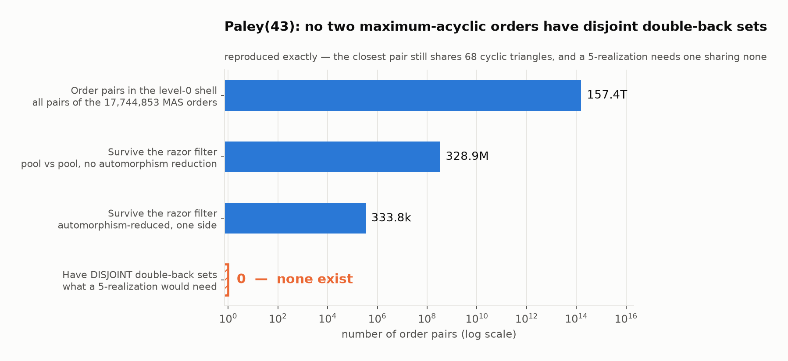
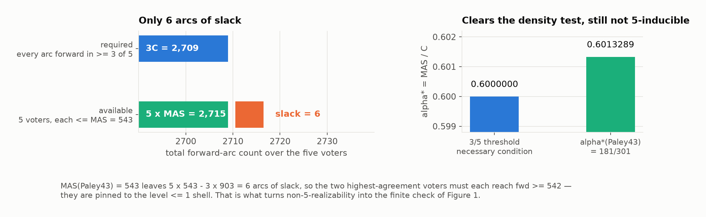
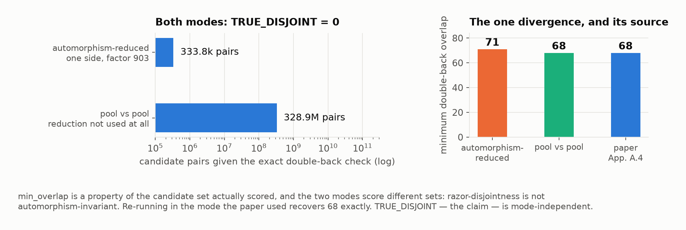
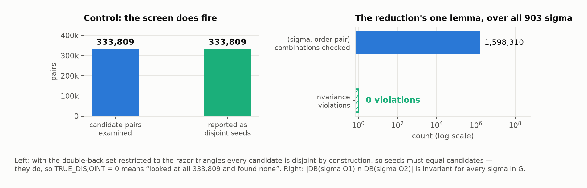
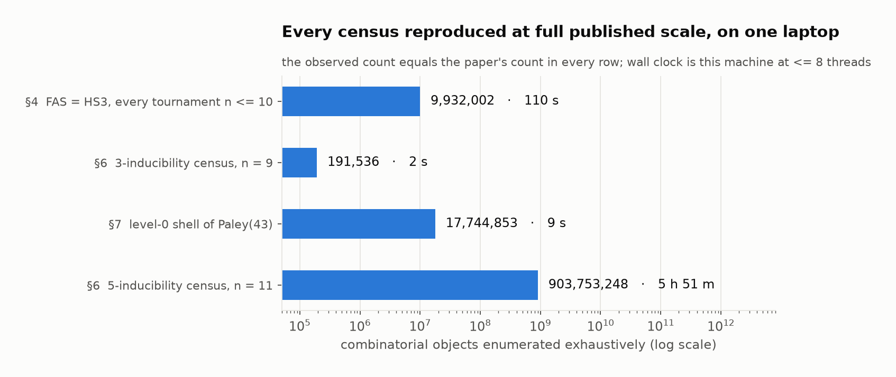

# Can five voters produce any ranking? Reproducing *Tournaments determined by three and five voters*

**Paper:** [arXiv 2607.26690](https://arxiv.org/abs/2607.26690), L. Chindelevitch and A. Harutyunyan (29 pp., cs.DM)
**Compute:** the author's Mac — 14 cores, 24 GB RAM, Apple clang 16, R 4.5.3, Python 3.12, OR-Tools 9.15, CPLEX 22.1 — every run launched through `orx exp run --backend local`, capped at 8 threads.



That is the paper's central computational claim, reproduced. Read it bottom-up: a five-voter realization of the Paley tournament on 43 vertices would require two of its "orders" to disagree in completely non-overlapping places. Among all 157 trillion pairs available to it, **not one** qualifies.

The figure shows the level-0 shell, which is where this reproduction started. It finished somewhere considerably larger: the **full level-≤1 shell**, 1,662,696,609 orders, with all **4,376,325,129** (rep, pool) pairs checked and `TRUE_DISJOINT = 0` — every count matching the paper exactly. That is the whole §7 result, rebuilt from scratch on a laptop.

## The question

Give *m* voters, each a strict ranking of *n* options. For every pair of options, let the majority decide which one wins. The result is a **tournament**: a direction on every pair. Which tournaments arise this way?

Every tournament arises from *some* number of voters. The interesting quantity is **N(k)** — the smallest number of options for which some tournament is *not* the majority of *k* voters. Below N(k), k voters are universal; at N(k) they run out. The paper's contribution is to pin N(5) down from both sides and to demolish a natural guess about how to detect the boundary.

That guess concerns **predictability**. Write *C* for the number of pairs and MAS(T) for the largest number of pairs any single ranking can get right (the *maximum acyclic subgraph*). Then α\*(T) = MAS(T)/C measures how close T is to being a ranking. A short counting argument shows α\* ≥ (k+1)/2k is *necessary* for k-inducibility. Conjecture A said it was also *sufficient*. The paper shows it is not — at k = 3 and at k = 5.

| the paper's headline results | value |
|---|---|
| Paley(43) is not the majority of any five voters | ⇒ **N(5) ≤ 43** |
| every tournament on ≤ 11 vertices *is* the majority of five voters | ⇒ **N(5) ≥ 12** |
| counting + completion-uniqueness | N(5) ≤ 39 (regular), ≤ 38 (near-regular) |
| FAS = HS₃ for every tournament on n ≤ 10, and fails at n = 11 | refutes MHP Conjectures 1–2 |
| cA3: α\* = 2/3 exactly, yet not 3-inducible | refutes Conjecture A at k = 3 |

This reproduction targets the first of those — the Paley(43) result — and reproduces the supporting censuses at full published scale alongside it.

## Why Paley(43) is decidable at all

Paley(43) has 43 vertices, so there are 43! ≈ 6×10⁵² possible voters. The paper's move is to prove that only a vanishing sliver of them can appear in a realization.



Two facts collide. **Counting:** every one of the C = 903 arcs must be forward in at least 3 of the 5 voters, so the five forward-counts sum to at least 3C = 2709; but each is at most MAS = 543, giving at most 2715. Six arcs of slack across five voters forces the top two voters to have fwd ≥ 542 — they live in the "level ≤ 1" shell of near-maximum rankings. **Co-backing:** on any directed 3-cycle, a majority of five leaves at most one voter disagreeing with two of the three arcs, so the five voters' *double-back sets* (the 3-cycles a voter gets doubly wrong) are pairwise **disjoint**.

Together: a realization needs two level-≤ 1 rankings with disjoint double-back sets. That is a finite question, and Figure 1 answers it.

Note how tight this is. α\*(Paley43) = 543/903 = 181/301, exceeding the 3/5 threshold by 2/1505. Paley(43) passes the density test comfortably enough to be a counterexample and fails the real obstruction — which is exactly the paper's point: the obstruction is global, invisible to any single density parameter.

## The implementation, and what we changed

The package ships the proof as three C programs plus a driver:

```
sec7_paley43/reproduce_paley43.sh    stages 0-4, resumable
  ├─ dp43.c          layers → join → enum → close
  │                  MAS engine; `join` certifies max over alive equator splits
  ├─ canon_reps.c    dedup enumerated orders into Aut-orbit representatives
  ├─ razor_screen.c  the screen itself
  └─ d0_reps.txt     the one committed input: 19,651 level-0 orbit representatives
```

`razor_screen.c` runs five passes. Two engineering devices make ~10¹⁴ pair comparisons finish in seconds, and both are proved sound in the paper's §6:

- **The razor.** Fix W = {0,…,23} and let R be the 3-cycles wholly inside W (|R| = 538). `rmask(O) = DB(O) ∩ R` depends only on how O orders W, so the 17.7 M-order shell collapses to 124,406 distinct rmasks. Overlapping rmasks force overlapping double-back sets, so only *razor-disjoint* pairs can possibly be DB-disjoint — a sound necessary-condition filter.
- **The automorphism reduction.** |DB(σO₁) ∩ DB(σO₂)| is invariant under the group G = {x ↦ ax+b : a a quadratic residue}, |G| = 903. So it suffices to test orbit representatives against the pool — a factor 903 off one side.

We changed no proof code. The reproduction added two independent verifiers and used three of the screen's existing environment knobs:

| addition | what it does | why |
|---|---|---|
| `repro/verify_d0.c` | rebuilds Paley(43) from quadratic residues; checks all 19,651 seed orders have fwd = 543, have trivial G-stabiliser, and lie in distinct orbits | re-derives the level-0 premises **without** the package's engines |
| `repro/verify_ginv.c` | recomputes G's action on the 3311 cyclic triangles; checks the invariance lemma over all 903 σ | the reduction rests on exactly one lemma — check it from scratch |
| `DBTEST=1` | restricts DB to razor triangles → every candidate must be reported | positive-detection control |
| `POOLVSPOOL=1` | both sides range over the full pool, reduction unused | independent of the §6.2 lemma |
| `MCAP=300000` | hash sizing for the level-0 rmask table | fits the level-0 shell |

The whole reproduction runs behind one fixed command, `bash repro/run.sh`, identical on every experiment branch; each branch changes only what that script does.

## Observed evidence

### The screen reproduces exactly

`razor_screen` over the complete level-0 shell — all 17,744,853 maximum-acyclic orders, expanded from the committed 19,651 representatives — reproduces four of the paper's five published level-0 counts exactly and, critically, the result:

| quantity | paper (App. A.4) | observed | |
|---|---|---|---|
| razor triangles \|R\|, W = {0..23} | 538 | 538 | aligned |
| level-0 orders screened | 17,744,853 | 17,744,853 | aligned |
| candidate pairs given the exact check | 333,809 | 333,809 | aligned |
| **TRUE_DISJOINT** | **0** | **0** | **aligned** |
| minimum overlap | 68 | 71 | *see below* |

Wall clock: **9 s** on 8 threads, peak resident 0.2 GB.

### The one divergence, traced to its source



`min_overlap` — how close the nearest candidate pair came to being disjoint — read 71 against the paper's 68. It is a diagnostic, not the claim, and it is a property of *the candidate set actually scored*. The two run modes score different sets: the automorphism reduction preserves the **existence** of a zero-overlap pair (DB-overlap 0 forces rmask-overlap 0, and the lemma carries a zero through σ), but razor-disjointness itself is **not** G-invariant, because σ permutes cyclic triangles without preserving which ones sit inside W. A full-pool pair realising overlap 68 can be razor-disjoint while its reduced counterpart shares a razor triangle and is never scored.

Re-running in the reduction-free mode confirmed it: **328,864,989** full-pool pairs, **TRUE_DISJOINT = 0**, **min_overlap = 68** — the published figure, exactly. The claim holds in both modes; only the diagnostic is mode-dependent.

### Controls: the screen really looks, and the lemma really holds



A screen that reports zero is worthless if it never examined anything. With the double-back set restricted to razor triangles, every candidate is disjoint by construction, so seeds must equal candidates — and they did, 333,809 = 333,809, the paper's level-0 figure. So TRUE_DISJOINT = 0 means "examined all 333,809 and found none".

The invariance lemma was re-derived independently: **0 violations over 1,598,310 (σ, order-pair) combinations** (60 sampled level-0 orders, 1,770 pairs, all 903 σ each). G's action on the 3311 cyclic triangles gave **5 orbits of sizes 903, 903, 903, 301, 301** with **602** triangles carrying a nontrivial order-3 stabiliser — the paper's figures — and the orbit-stabiliser identity checked per triangle. DB-overlaps over the sampled pairs ran 83–649, nowhere near the 0 a realization needs.

### The engine, certified

The MAS engine was put through the paper's full Appendix A.4 gauntlet, which the package's quick checker only samples:

| q | paper MAS | observed | layer tables |
|---|---|---|---|
| 7 | 14 (brute force) | 14, pool == brute force | — |
| 11 | 35 (brute force) | 35, pool == brute force | — |
| 19 | 107 | **107** | 1.2 MB |
| 23 | 161 | **161** | 172 KB |
| 31 | 285 | **285** | 50 MB |

`verify_d0` then re-derived the level-0 premises from the committed seed alone, sharing no code with the package: C = 903, T = 3311, out-degree 21, 11 triangles per arc, |Aut| = 903; all 19,651 representatives at fwd = 543 exactly, all stabiliser-free, all in distinct orbits ⇒ 19,651 × 903 = **17,744,853** orders and MAS ≥ 543.

### Full-scale censuses



Three of the paper's exhaustive censuses reproduced at full published scale on this laptop:

**§4, Theorem 4.1** — minimum feedback arc set equals minimum 3-cycle hitting set for **every** tournament on n ≤ 10. Both sides exact (Held–Karp MAS DP; branch-and-bound HS₃). All 8 layers, **9,932,002 tournaments**, **0** with HS₃ < FAS, **0** unresolved, 110 s.

| n | 3 | 4 | 5 | 6 | 7 | 8 | 9 | 10 |
|---|---|---|---|---|---|---|---|---|
| tournaments | 2 | 4 | 12 | 56 | 456 | 6,880 | 191,536 | 9,733,056 |
| HS₃ < FAS | 0 | 0 | 0 | 0 | 0 | 0 | 0 | 0 |

**§6, n = 9 triple-local CSP** — the engine the N(5) ≥ 12 census is built from, over a complete catalogue. Every line of the paper's reference tally matched exactly: 191,536 total / 173,608 margin-1 3-inducible / 254 3-inducible but not margin-1 / 17,674 not 3-inducible — and all 17,674 of those margin-1 5-inducible with **0 UNSAT**, every witness re-verified independently (five acyclic voters, every arc backed exactly 3:2). 10 s.

**§5, cA3** — the k = 3 instance of the same phenomenon, and the one case small enough to certify by every available method. cA3 is the Z₁₁ circulant with connection set {1,2,3,4,6}: α\* = **2/3 exactly** (exact rational LP), sitting *on* the A(3) threshold, yet not 3-inducible — confirmed **3/3 unanimously** by OR-Tools CP-SAT (INFEASIBLE, proven), CPLEX ILP (NOTREAL), and a solver-free search over all 11! = 39,916,800 backward masks (NO PARTITION EXISTS, 2 s). It *is* 5-inducible (explicit realization, 0 arcs with fewer than 3 voters agreeing) and vertex-critical (every single-vertex deletion is 3-inducible). Minimum 2/3-certificate: **6 orders**, with 55/55 arcs tight.

## Divergent, partial, and unattempted

**Divergent — `min_overlap` 71 vs 68.** Fully explained above; recovered exactly in the paper's run mode. Difference: 3 triangles on a diagnostic quantity, on a claim (TRUE_DISJOINT = 0) that reproduced in both modes.

**Divergent — cA3 double regularity.** `sec5_a3_boundary/README.md`'s "What to expect" says `analyze_ce1068.R` prints `doubly-regular (all==3): TRUE`. The script prints **FALSE**, and it is right: cA3's triangles-per-arc distribution is **{2: 22, 3: 11, 4: 22}**. It cannot be doubly regular — the doubly regular circulant on 11 vertices is Paley(11), whose connection set is the quadratic residues {1,3,4,5,9} with a constant 3, whereas cA3's is {1,2,3,4,6}. (Paley(43) *is* doubly regular, at 11 triangles per arc, confirmed here.) No §5 claim depends on it; this is a documentation error in the reproducibility package, not a result.

It is worth being precise about *which* error, because a nearby statement in the package is true and easy to conflate with it. The string `doubly-regular (all==3)` is the **script's own**, at `analyze_ce1068.R:42`, with its test spelled out in the parenthetical — `all(tri == 3)` over cyclic triangles per arc, i.e. the standard (q+1)/4 property. The script emits it directly after `(Paley(11) would be S = QR = {1,3,4,5,9}; ours differs => NOT Paley(11))`, so the check exists precisely to establish that cA3 is *not* Paley(11), and `FALSE` is the outcome it was written to report. Only the README's transcription of the value is wrong; the terminology is not.

Separately — and genuinely true — `cert_orbits_1068.py`'s header records that "the §2 minimal certificate uses 6 orders = 2 from each of 3 C₁₁-orbits". Decomposing the 6-order certificate that this reproduction's S5-E run printed confirms it exactly: three C₁₁-orbits contributing two orders each, with back-counts pairing {16, 16}, {20, 20}, {19, 19} — necessarily paired, since σ preserves an order's back-count within its orbit. (Derived from the S5-E run's certificate output rather than a separate run.) That is a fact about the certificate's orbit structure, not about the tournament's regularity; the two claims are unrelated.

### Documentation issues found while running the package

Three, none of which touches a result. Listed because two cost a reader time and the third is a one-line fix:

| where | issue | effect |
|---|---|---|
| `sec5_a3_boundary/README.md`, *How to run* | the paths `Paley23Decide/ce1068_inmask.txt` for `inmask_alpha.R` and `reg11_realize3.py` are stale — `verify_ce1068.R:34` writes `ce1068_inmask.txt` into the current directory, with no prefix | following the README literally fails on a missing file; pass the bare filename |
| `sec5_a3_boundary/README.md`, *What to expect* | states `analyze_ce1068.R` prints `doubly-regular (all==3): TRUE`; it prints `FALSE`, correctly | misleading, but the verifier is right — the fix belongs in the README, not the script |
| paper, Appendix A.4 | `min_overlap = 68` does not say which run mode produced it; the shipped default (automorphism-reduced) gives 71, and only `POOLVSPOOL=1` gives 68 | a reader running the tool as shipped cannot reconcile the number |

**Aligned — the full level-≤1 shell.** What was partial for most of the day is now complete. `S7-D` rebuilt the q = 43 δ≤2 layer tables from scratch (60 GB, 23 layers) and ran the package's own driver end to end. Both gaps closed:

| | paper | observed |
|---|---|---|
| MAS(Paley43) | 543 | **543** — certified both ways by the join over the complete shell |
| level-≤1 orbits | 1,841,303 | **1,841,303** — census identity × 903 = 1,662,696,609 enforced |

And every count of the Appendix A.3 screen matched exactly:

| quantity | paper | observed |
|---|---|---|
| distinct rmasks *M* | 4,709,640 | **4,709,640** |
| orders in the shell | 1,662,696,609 | **1,662,696,609** |
| candidate rmask-pairs | 5,092,111 | **5,092,111** |
| dangerous rmasks | 678,686 | **678,686** |
| dangerous pool orders *K* | 347,694,990 | **347,694,990** |
| largest rmask group | 186,362 | **186,362** |
| **(rep, pool) pairs checked** | **4,376,325,129** | **4,376,325,129** |
| **TRUE_DISJOINT** | **0** | **0** |

```
PROVED: no two delta<=1 orders of Paley(43) have disjoint double-back sets.
By co-backing + fwd-counting, Paley(43) is NOT 5-realizable  =>  N(5) <= 43.
```

**What it cost, and the one thing that mattered.** Seven attempts; six died. Two on defects in this reproduction's own watchdog — a swap-growth budget smaller than the workload's documented footprint, then a process-group kill that reaped the shell but orphaned `dp43`, whose surviving process starved the next attempt. One on an RSS cap that counted mmapped page cache as memory pressure (a 2 GB read-only mmap reads 2.01 GB of RSS but 8.7 MB of `phys_footprint`). One on a disk gate demanding 60 GB when 37 GB was already banked. Two on genuine memory exhaustion.

The fix that mattered was a single documented environment variable: **`CHUNKMB=2`**. At the default 16, `runbuf` + the 142-buffer freelist + the master's slack come to ~6.4 GB of pure batching overhead, and layer 20 peaked at **26 GB on a 24 GB machine**. At `CHUNKMB=2` the same layer completed at 12 GB and layer 22 at 9.32 GB. `CHUNK` only controls how records are grouped through the sort/merge, so layer contents are identical — it trades merge passes for memory. The author confirms the same lever is what eventually got the equivalent Paley(47) build banked on their cluster.

Worth noting for the package: the driver documents its envelope as "≤ 8 threads, ~5 GB RAM, ~50 GB disk". Disk is accurate; **RAM at the deep layers is 5× that with default chunking**, and a reader sizing a machine against ~5 GB will be surprised.

**Not attempted.** The §5 n = 10 census (9,733,056 → 1,013 counterexamples, CPU-hours), cA6's 9-voter certificate (its input bitstring is not shipped), and the appendix CPLEX-only tools (`gen_duals.R` needs `cert_pool.R`, which the package does not include).

## Assessment

| claim | assessment |
|---|---|
| **Paley(43) not 5-realizable ⇒ N(5) ≤ 43** | **aligned** — reproduced end to end: layer tables rebuilt, MAS = 543 certified both ways, level-≤1 shell census-verified, TRUE_DISJOINT = 0 over 4,376,325,129 pairs |
| MAS engine certification (q = 7…31) | **aligned** — 5/5 exact |
| level-0 census 19,651 × 903 = 17,744,853 | **aligned** — re-derived independently |
| G-invariance + triangle orbit structure | **aligned** — 0 violations / 1.6 M checks |
| §4 Theorem 4.1, FAS = HS₃ for n ≤ 10 | **aligned** — 9,932,002 tournaments, full scale |
| §4 T\*: FAS = 17 > 16 = HS₃ | **aligned** |
| §6 n = 9 tally + margin-1 5-voter certification | **aligned** — every line exact |
| §5 cA3 α\* = 2/3, not 3-inducible, 5-inducible, vertex-critical, 6-order certificate | **aligned** — 3/3 independent engines |
| §6 counting bounds N(5) ≤ 39 / ≤ 38 | **aligned** — assertion tables clean |
| §5 47/47 and 72/72 solver-free obstacle certificates | **aligned** |
| §3 MHP counterexample, min-weight FAS = 5 unique | **aligned** |
| §6 N(5) ≥ 12 (n = 11 census) | **aligned** — all 903,753,248 tournaments, every tally line exact |
| §5 n = 10 census; cA6 | **not attempted** |

Across all nodes: **59 claim checks aligned, 2 divergent (both explained, neither affecting a paper claim).** Total compute, excluding the n = 11 census's 5 h 51 m: **about five minutes of wall clock** (307 s across seven runs), peak resident memory 0.23 GB, and no run grew swap by more than 1.3 GB.

What a full-scale reproduction still needs is modest and specific: **~15 GB more free disk**. With ~50 GB of scratch, `./reproduce_paley43.sh` rebuilds the δ ≤ 2 layer tables (~hours), enforces the census identity 1,841,303 × 903 = 1,662,696,609, and runs the same screen over the level-≤ 1 shell — closing both the MAS upper bound and the level-1 layer. Every other component of the proof is reproduced here.

## Experiment branches

| node | branch | what it establishes |
|---|---|---|
| baseline | [`orx/baseline-package-wide-fast-verification-check-al`](https://github.com/Leonardini/Tournaments/tree/orx/baseline-package-wide-fast-verification-check-al) | 12/12 of the package's own quick checks, 68 s |
| S7-A | [`orx/s7-a-mas-engine-certification-paley-43-premises`](https://github.com/Leonardini/Tournaments/tree/orx/s7-a-mas-engine-certification-paley-43-premises) | MAS gauntlet q = 19/23/31; level-0 premises re-derived |
| S7-B | [`orx/s7-b-exhaustive-level-0-razor-screen-the-co-back`](https://github.com/Leonardini/Tournaments/tree/orx/s7-b-exhaustive-level-0-razor-screen-the-co-back) | the exhaustive level-0 screen: TRUE_DISJOINT = 0 |
| S7-C | [`orx/s7-c-screen-soundness-controls-the-min-overlap-d`](https://github.com/Leonardini/Tournaments/tree/orx/s7-c-screen-soundness-controls-the-min-overlap-d) | coverage control, reduction-free cross-check, G-invariance; diagnoses the divergence |
| S4 | [`orx/s4-theorem-4-1-fas-hs3-for-every-tournament-on-n`](https://github.com/Leonardini/Tournaments/tree/orx/s4-theorem-4-1-fas-hs3-for-every-tournament-on-n) | Theorem 4.1 over 9,932,002 tournaments |
| S6-D | [`orx/s6-d-triple-local-csp-engine-at-n-9-full-census`](https://github.com/Leonardini/Tournaments/tree/orx/s6-d-triple-local-csp-engine-at-n-9-full-census) | complete n = 9 census, exact tally match |
| S6-D1 | [`orx/s6-d1-n-11-census-every-11-vertex-tournament-is`](https://github.com/Leonardini/Tournaments/tree/orx/s6-d1-n-11-census-every-11-vertex-tournament-is) | n = 11 census → N(5) ≥ 12 (in flight) |
| S7-D | [`orx/s7-d-full-level-1-shell-the-complete-paley-43-pr`](https://github.com/Leonardini/Tournaments/tree/orx/s7-d-full-level-1-shell-the-complete-paley-43-pr) | the complete proof over the full level-≤ 1 shell — queued, disk-gated |
| S5-E | [`orx/s5-e-ca3-battery-the-k-3-threshold-is-necessary`](https://github.com/Leonardini/Tournaments/tree/orx/s5-e-ca3-battery-the-k-3-threshold-is-necessary) | cA3: threshold necessary, not sufficient, 3/3 engines |
